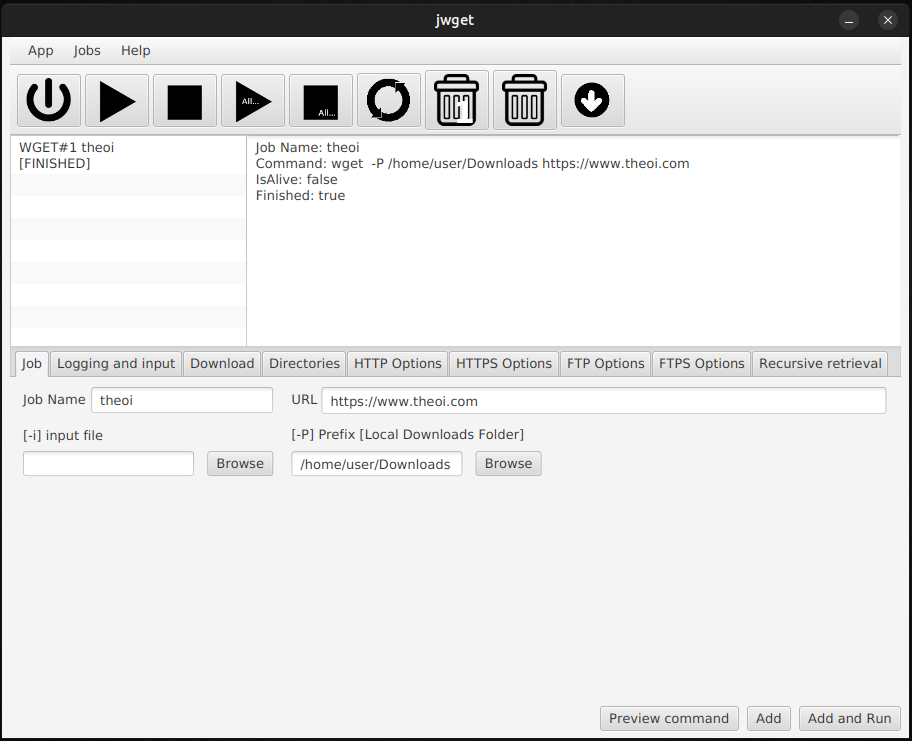

# jwget

jwget is a javaFX application, a gui for wget network downloader !

## Installation

You have to download javaFX library and install it somewhere in your system.

You can download the javaFX library from https://gluonhq.com/products/javafx/

jwget was developed with javaFX 19.0.2.1

1. Choose your operating system [Linux/Windows/macOS], then your architecture, and finaly choose SDK type.

2. Run the setup or unzip the package and install it in your system in your prefered directory.

3. Next copy the directory path and edit the jwget.sh for linux/macOS or jwget.bat for windows. Copy/paste the javaFX lib path to option -module-path=

4. Make sure you have wget binary file installed in your system.

5. Windows users can download https://gnuwin32.sourceforge.net/ and add the installation path of gnu32 bin to the PATH system variable. 

## Help of wget

For help for wget you can visit [wget(1) - Linux manual page](https://man7.org/linux/man-pages/man1/wget.1.html)

## Screenshot

