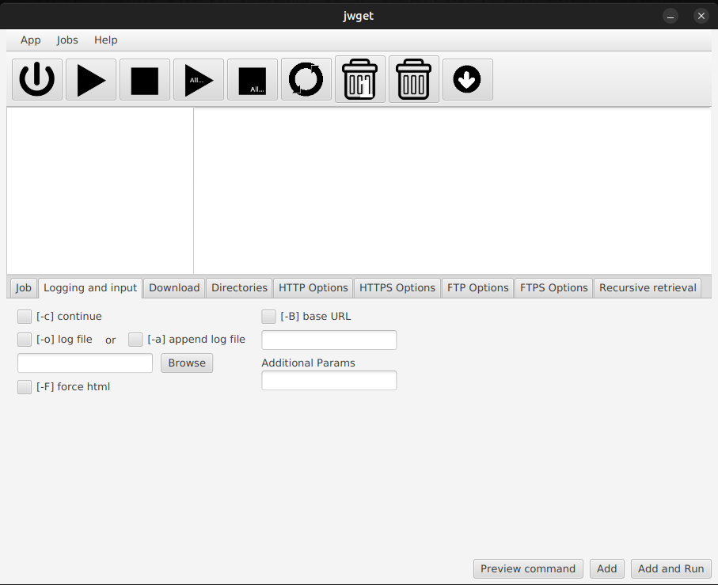
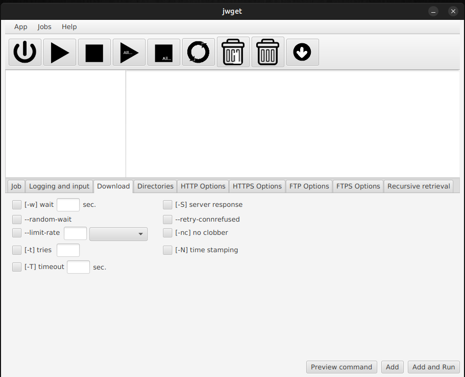
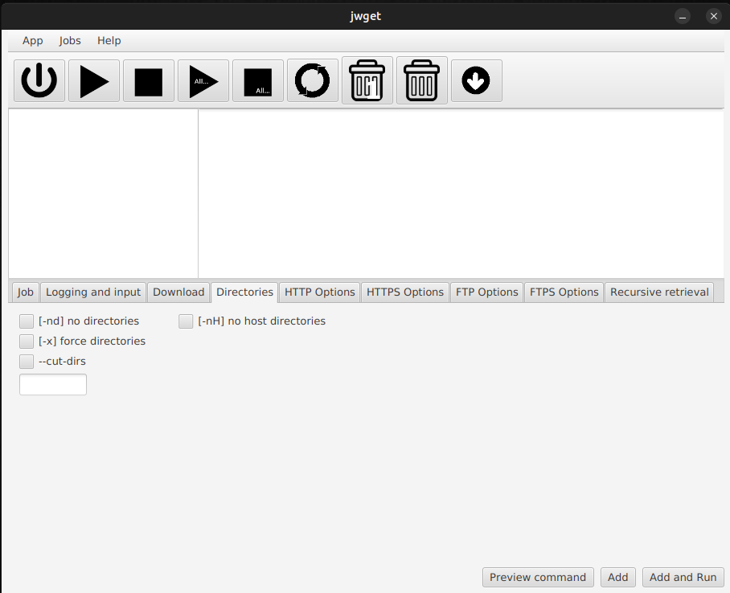
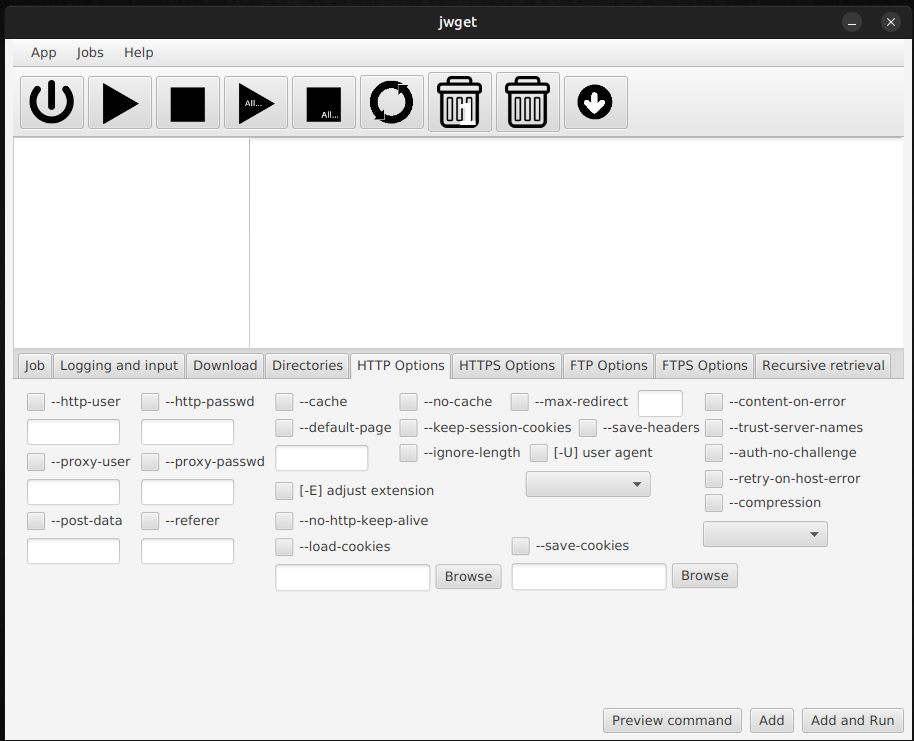
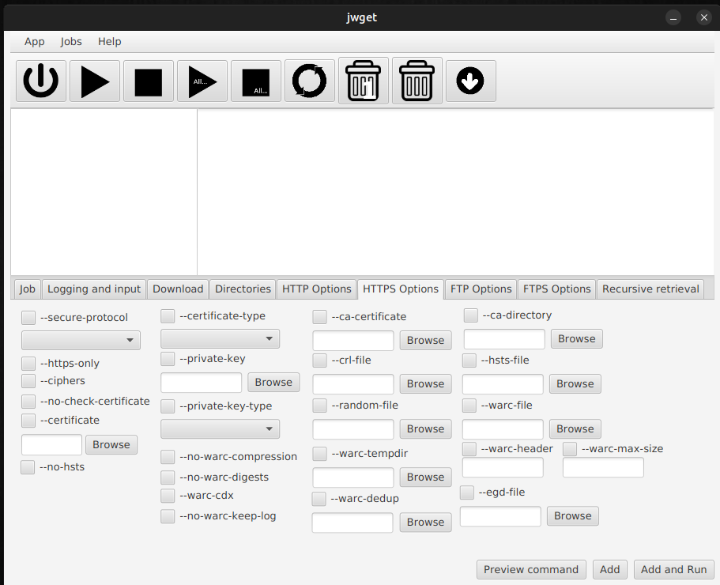
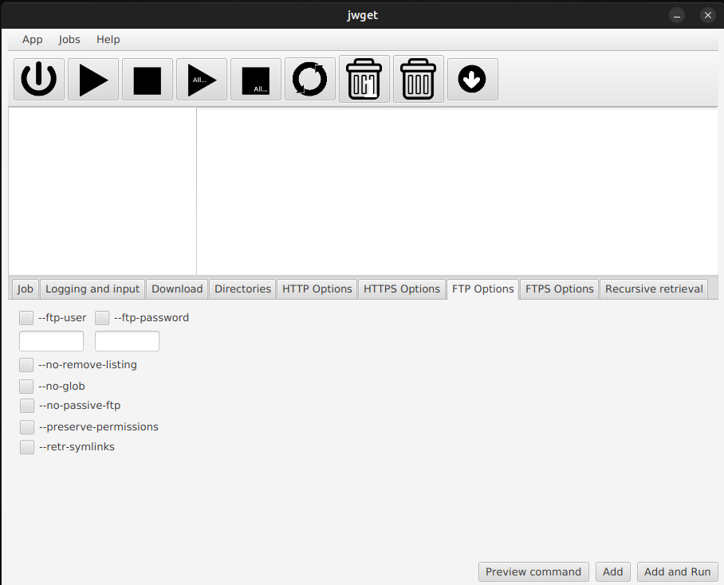
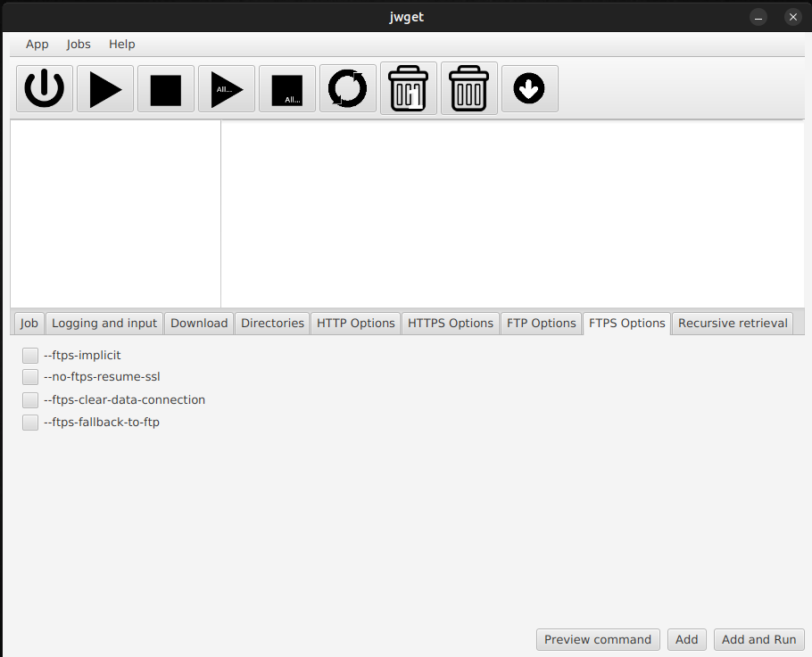
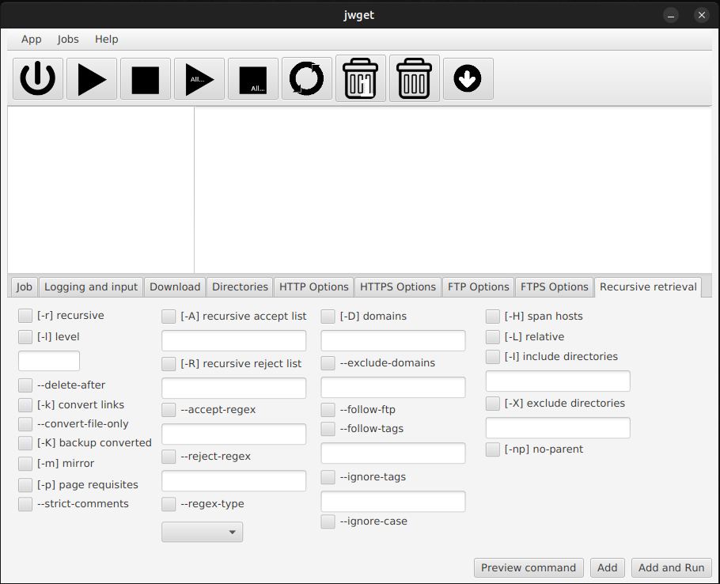

# jwget

`jwget` is a graphical user interface (GUI) for the [`wget`](https://www.gnu.org/software/wget/) file downloader, developed as a JavaFX application.

## Prerequisites

First, you need to 

1. install the Java Runtime Environment (JRE) in order to run Java applications.
2. install the JavaFX library

### Installing the Java Runtime Environment (JRE)

#### Installing the JRE on Ubuntu

Install the package `default-jre`. 

```
sudo apt install default-jre
```

### Installing the JavaFX library

The JavaFX library is available at https://gluonhq.com/products/javafx/ 

The _Downloads_ section of that site has a filter to help you select the appropriate archive. 

For Linux, select

1. Operating System: `Linux`
2. Architecture: `x86` (this is `x86_64`, suitable for 64-bit Intel/AMD CPUs)
3. Type: `SDK`

You will be downloading a ZIP file. Uncompress it on your system. Currently, the latest version of JavaFX is `19.0.2.1` and this program has been developed with that version. The command to uncompress the ZIP file is

```
unzip openjfx-19.0.2.1_linux-x64_bin-sdk.zip 
```

## Installation

1. Next copy the directory path and edit the jwget.sh for linux/macOS or jwget.bat for windows. Copy/paste the javaFX lib path to option -module-path=

4. Make sure you have wget binary file installed in your system.

5. Windows users can download https://gnuwin32.sourceforge.net/ and add the installation path of gnu32 bin to the PATH system variable. 

## Help of wget

For help for wget you can visit [wget(1) - Linux manual page](https://man7.org/linux/man-pages/man1/wget.1.html)

## Screenshots

















